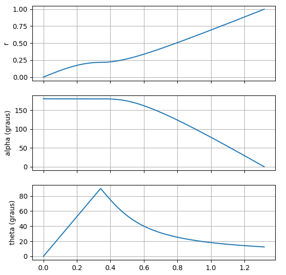
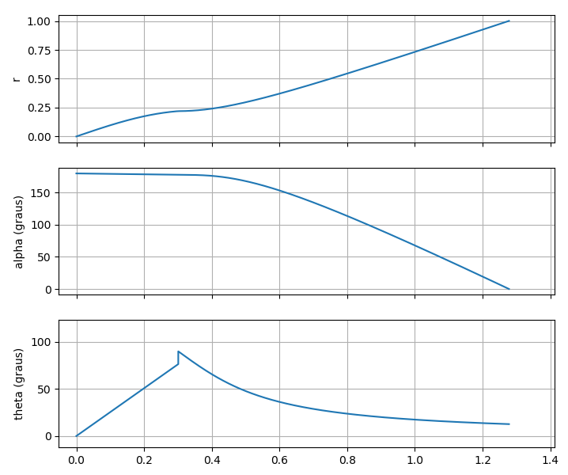
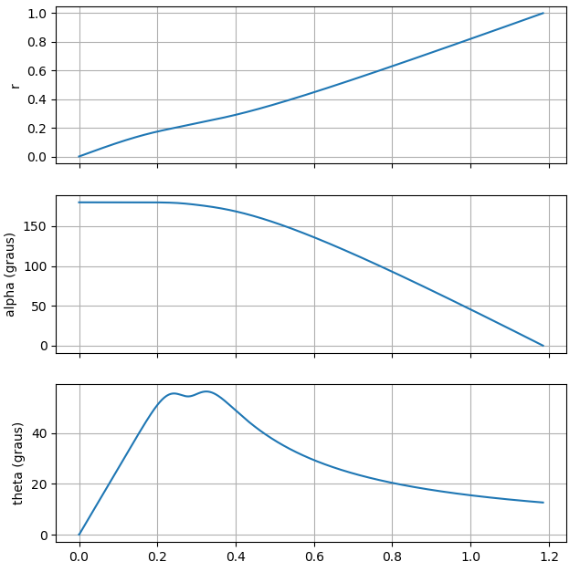

Para simplificar vou chamar Luke de L e Darth de D

Variaveis
- $v$: velocidade de L
- $v_r$: velocidade radial de L
- $v_t$: velocidade tangencial de L
- $w$: velocidade angular de L
- $r$: posição radial de L
- $w_d$: velocidade angular de D
- $k$: velocidade de D
- $R$: raio da estrela da morte = 1
- $\theta$: ângulo de decomposição da velocidade e L entre componente tangencial e radial.
- $\alpha$: ângulo entre D e L
- $\tau$: Tempo mínimo para L escapar

Sabe-se que a velocidade angular de D é:

$$ w_d = \frac{k}{R} = k$$

Além disso:

$$ w = \frac{v_t}{r} $$

Para certos valores de raio $r$, é possível $w \ge w_d$, ou seja L tem uma velocidade angular maior que a de D. Esse raio ocorre quando:

$$w=\frac{v_t}{r} \ge k$$

$$  \therefore\; r \le \frac{1}{k} $$

O caso limite é:

$$ \boxed{r^* = \frac{1}{k}} $$

Na corrida de L vs D, L quer percorrer radialmente a distância de 1 e D quer percorrer a distancia ângular $\pi$ radianos entre L e D.

Como até chegar nesse raio $r^*$ L pode ter uma velocidade angular $w > w_d$, L pode alcançar $r^*$ sem que D tenha progresso em sua missão. L pode alcançar $r^*$ dedicando parte de sua velocidade para compensar os progressos de D (velocidade tangencial $v_t$) e ainda sobrar uma componente radial para sua velocidade.

Assim, L pode chegar a $r^*$ mantendo a distância angular entre L e D constante em $\pi$.

A decomposição da velocidade de L pode ser feita utilizando o ângulo $\theta$.

$$ \boxed{v_r = cos(\theta)}$$

$$ \boxed{v_t = sen(\theta)}$$

Sabemos que a distância total que L deve percorrer depois de alcançar $r^*$ mantendo a distância angular entre D e L em $\pi$ é:

$$ \int_{0}^{t_0}v_r dt = 1 - r^* $$

$$ \int_{0}^{t_0} \frac{ v_r}{1 - r^*} dt = 1 $$

$$ \boxed{\int_{0}^{t_0} \frac{cos(\theta)k}{ k - 1 } dt = 1} $$

Vamos definir o progresso de L ($p_L$) em sua missão como:

$$p_L = \frac{cos(\theta)k}{ k - 1 }$$

Sabemos que a distância total que D deve percorrer é:

$$\int_{0}^{t_0} ( w_d - w ) dt = \pi$$

$$\int_{0}^{t_0} \frac{1}{\pi} \left( k - \frac{v_t}{r} \right) dt = 1$$

$$\int_{0}^{t_0} \frac{1}{\pi} \left( k - \frac{sen(\theta)}{r} \right) dt = 1$$

$$\boxed{\int_{0}^{t_0} \frac{ rk - sen(\theta) }{r\pi} dt = 1}$$

Vamos definir o progresso de D ($p_D$) em sua missão como:

$$ p_D = \frac{ rk - sen(\theta) }{r\pi} $$

Agora, podemos definir um coeficiente de progresso relativo ($y$) entre L e D, tal que quanto maior $y$, melhor para L

$$ y = \frac{p_L}{p_D}$$
$$ \boxed{y= \frac{cos(\theta)k}{ k - 1 }.\frac{r\pi}{ rk - sen(\theta) }}  $$

Assim, podemos achar $\theta$ tal que $y$ é máximo:

$$\frac{dy}{d\theta} = 0$$

$$\frac{d}{d\theta}\left(\frac{cos(\theta)k}{ k - 1 }.\frac{r\pi}{ rk - sen(\theta) }\right) = 0$$

$$\frac{d}{d\theta}\left(\frac{cos(\theta)}{ rk - sen(\theta) }\right) = 0$$

$$\frac{d}{d\theta}cos(\theta)\left(\frac{1}{ rk - sen(\theta) }\right) + cos(\theta)\frac{d}{d\theta}\left(\frac{1}{ rk - sen(\theta) }\right) = 0$$

$$\left(\frac{-sen(\theta)}{ rk - sen(\theta) }\right) + \frac{cos^2(\theta)}{(rk - sen(\theta))^{2}} = 0$$

$$ \frac{-sen(\theta)(rk - sen(\theta)) + cos^2(\theta)}{(rk - sen(\theta))^2} = 0$$

$$ \frac{-sen(\theta)rk + sen^2(\theta) + cos^2(\theta)}{(rk - sen(\theta))^2} = 0$$

$$ \frac{-sen(\theta)rk + 1}{(rk - sen(\theta))^2} = 0$$

Note que no caso que $r \ge r^*$:

$$r^* < r \le 1$$

$$\frac{1}{k} < r \le 1$$

Para $\frac{1}{k} < r \le 1$ e fazendo com que $\theta \neq \frac{\pi}{2}$:

$$kr - sen(\theta)  > 1 - sen(\theta) > 0$$

Assim:

$$-sen(\theta)rk + 1 = 0$$

$$sen(\theta)  =  \frac{1}{rk}$$

Com:
$$\frac{1}{k} < r \le 1$$

$$1 \le \frac{1}{r} < k$$

$$\frac{1}{k} \le \frac{1}{rk} < 1$$

$$\frac{1}{k} \le sen(\theta) < 1$$

Portanto, quando $r^* < r \le 1$, o $\theta$ que otimiza o progresso de L é:

$$\boxed{\theta = arcsen  \frac{1}{rk}} $$

Com isso:

$$ v_r = \dot{r} = cos(\theta) = cos\left(arcsen\frac{1}{rk}\right)= \sqrt{1 - \frac{1}{r^2k^2}}$$

$$ \frac{\dot{r}}{\sqrt{1 - \frac{1}{r^2k^2}}} = 1$$

$$ \int\frac{dr/dt}{\sqrt{1 - \frac{1}{r^2k^2}}}dt = \int 1dt$$

$$ \int\frac{1}{\sqrt{1 - \frac{1}{r^2k^2}}}dr = t + K'$$

$$ \int\left( 1 - \frac{1}{r^2k^2}\right)^{-0.5}dr = t + K'$$

$$ r\left( 1 - \frac{1}{r^2k^2}\right)^{0.5} = t + K$$

$$ \left( 1 - \frac{1}{r^2k^2}\right)^{0.5} = \frac{t + K}{r}$$

$$ \left( 1 - \frac{1}{r^2k^2}\right) = \frac{(t + K)^2}{r^2}$$

$$ \left( r^2 - \frac{1}{k^2}\right) = (t + K)^2$$

$$ r^2 = (t + K)^2 + \frac{1}{k^2}$$

$$ r = \sqrt{t^2 + 2tK + K^2 + \frac{1}{k^2}}$$

Como:

$$r(0) = \frac{1}{k} = \sqrt{ K^2 + \frac{1}{k^2}} $$

$$K = 0$$

$$r(t_0) = 1 = \sqrt{t_0^2 + 2t_0K + K^2 + \frac{1}{k^2}}$$

$$1 = t_0^2 + \frac{1}{k^2}$$

$$\boxed{t_0 = \sqrt{1-\frac{1}{k^2}}}$$

Assim:

$$ \boxed{r = \sqrt{t^2 + \frac{1}{k^2}}}$$

$$ v_t = sen\left(arcsen\frac{1}{rk}\right)  $$

$$ \boxed{v_t = \frac{1}{rk}} $$

Utilizando essa trajetória otimizada:

$$\int_{0}^{t_0} \frac{1}{\pi}\left( k - \frac{v_t}{r} \right)  dt  = 1$$

$$\int_{0}^{t_0} \frac{1}{\pi}\left( k - \frac{1}{r^2k} \right)  dt  = 1$$

$$\int_{0}^{t_0} \frac{k}{\pi}\left( 1 - \frac{1}{r^2k^2} \right)  dt  = 1$$

$$\int_{0}^{t_0}\left( 1 - \frac{1}{r^2k^2} \right)  dt  = \frac{\pi}{k}$$

$$\int_{0}^{t_0}\left( 1 - \frac{1}{(t^2 + \frac{1}{k^2})k^2} \right)  dt  = \frac{\pi}{k}$$

$$\int_{0}^{t_0}\left( 1 - \frac{1}{t^2k^2 + 1} \right)  dt  = \frac{\pi}{k}$$

$$\int_{0}^{t_0}\frac{1}{t^2k^2 + 1} dt  = t_0-\frac{\pi}{k}$$

$$ \frac{1}{k}\left(arctan(kt_0)-arctan(0)\right) = t_0-\frac{\pi}{k}$$

$$ arctan(k t_0)-arctan(0) = k\sqrt{1-\frac{1}{k^2}}-\pi$$

$$ arctan(k t_0) = k\sqrt{1-\frac{1}{k^2}}-\pi$$

$$ k t_0 = tan\left(k\sqrt{1-\frac{1}{k^2}}-\pi\right)$$

$$ k \sqrt{1-\frac{1}{k^2}} = tan\left(k\sqrt{1-\frac{1}{k^2}}\right)$$

$$ \sqrt{k^2-1} = tan\left(\sqrt{k^2-1}\right)$$

$$\sqrt{k^2-1}=4.4934$$

$$\boxed{k_{lim}=4.6033}$$

$$\boxed{t_0=0.9761}$$

___

Podemos refazer as análises para $r^* < r < 1$ e o ângulo ao final do período entre L e D $\alpha=\alpha_o$, com $\alpha \le \pi$:

$$\boxed{\theta = arcsen  \frac{1}{rk}} $$

$$\boxed{t_0 = \sqrt{1-\frac{1}{k^2}}}$$

$$\boxed{ r = \sqrt{t^2 + \frac{1}{k^2}}}$$

$$\boxed{ \sqrt{k^2-1} = tan\left(\sqrt{k^2-1}-\alpha_o\right)}$$
___

Temos que calcular agora a trajetória ótima de L indo do centro até $r^*$, que tem como duração $\tau$ e que encerra com ângulo entre L e D em $\alpha$

Para $0 < r < r^*$:

$$\boxed{\int_{0}^{\tau}\left(k-\frac{sen(\theta)}{r}\right)dt = \pi-\alpha_o}$$

$$\boxed{\int_{0}^{\tau}cos(\theta)dt = \frac{1}{k}}$$

___

E se a pegarmos uma solução particular da forma?

$$\frac{sen(\theta)}{r} = k-\beta$$

Assim:

$$\int_{0}^{\tau}\left(k-\frac{sen(\theta)}{r}\right)dt = \pi-\alpha_o$$

$$\int_{0}^{\tau}\left(k-(k-\beta)\right)dt = \pi-\alpha_o$$

$$\int_{0}^{\tau}\beta dt = \pi-\alpha_o$$

$$\beta\tau = \pi-\alpha_o$$

$$\boxed{\beta = \frac{\pi-\alpha_o}{\tau}}$$

$$sen(\theta) = r (k-\beta)$$

$$sen(\theta) = r (k-\frac{\pi-\alpha_o}{\tau})$$

$$\boxed{sen(\theta) = r\gamma}$$

Ou:

$$\boxed{\theta = arcsen(r\gamma)}$$

Com:

$$\boxed{\gamma = k-\frac{\pi-\alpha_o}{\tau}}$$

$$\frac{d}{dt}sen(\theta) = \frac{d}{dt}r\gamma$$

$$cos(\theta)\dot{\theta} = \dot{r}\gamma$$

$$\dot{\theta} = \gamma$$

$$\theta = \gamma t + \theta_0$$

Quando t=0:

$$\theta(t=0) = 0 = \theta_0$$

$$\boxed{\theta_0 = 0}$$

Além disso:

$$\sqrt{k^2-1} = tan\left(\sqrt{k^2-1}-\alpha_o\right)$$

Caso $k=0.99*k_{lim}$, e $0<\alpha_o<\pi$

$$arctan(\sqrt{k^2-1})= \sqrt{k^2-1}-\alpha_o$$

$$\alpha_o=arctan\left(\sqrt{k^2-1}\right)-\sqrt{k^2-1}$$

$$\boxed{\alpha_o = 3.0966 = 177.424^o}$$

Também:
$$\dot{r} = cos(\theta) = cos(\gamma t)$$

$$r = \frac{1}{\gamma} sin(\gamma t)$$

Para $t=\tau$:

$$\frac{1}{k} = \frac{1}{\gamma} sin(\gamma \tau)$$

$$\frac{1}{k} = \frac{\tau}{k\tau-\pi+\alpha_o} sin(k\tau-\pi+\alpha_o)$$

$$\boxed{\tau = 0.298}$$

O tempo total $T$ nessa condição é:

$$T=t_0+\tau$$

$$\boxed{T=1.2741}$$

$$\boxed{\beta = 0.1510}$$

$$\boxed{\gamma = 4.4063}$$

A minha primeira sugestão de trajetória é seguir uma estratégias com 2 estágios. 

1) Manter o ângulo $\theta = arcsen(r\gamma)$ até alcançar $r=1/k$
2) Posteriormente, manter o ângulo $\theta = arcsen(1/rk)$

____

A simulação da estrategia via python pode ser descrita da forma:

    def get_theta(r):
        if r < 1/k:
            theta = math.asin(r * gamma)
        else:
            theta = math.asin(1/(r * k))
        return theta

    def first_derivative(x, t0, k):
        theta = get_theta(x[0])
        if x[0] < 0.0001:
            xdot = np.array([
                1,
                -k 
            ])
        else:
            xdot = np.array([
                math.cos(theta),
                -k + math.sin(theta) / x[0]
            ])
        return xdot

Desta forma obtemos no caso $k=k_{lim}$:

Já no caso $k=k_{lim}*0.99$:

Os gráficos de trajetória tornam evidente a ineficiência da estratégia, especialmente na transição em torno de $r=1/k$.
Acredito que uma função contínua em que $\theta$ tende para a funcão descrita no caso $k=k_{lim}$ deve ser a curva de menor tempo.

Uma função candidata para fazer essa transição suave é:

$$sen(\theta) = rkL_1 + \frac{1}{rk}L_2 $$

Tal que $L_1(r)$ é a função logística centrada em $1/k$:

$$ L_1(r) = \left(1 - \frac{1}{1+exp\left(-\zeta (r-1/k)\right)}\right)^a$$

$$ L_2(r) = \left(\frac{1}{1+exp\left(-\zeta (r-1/k)\right)}\right)^a$$

Utilizando simulações em python, conseguimos otimizar o tempo total com relação aos parâmetros $\zeta$ e $a$.

Com isso, para:

$$\boxed{\zeta=80}$$
$$\boxed{a=1.3}$$
$$\boxed{T = 1.185}$$

